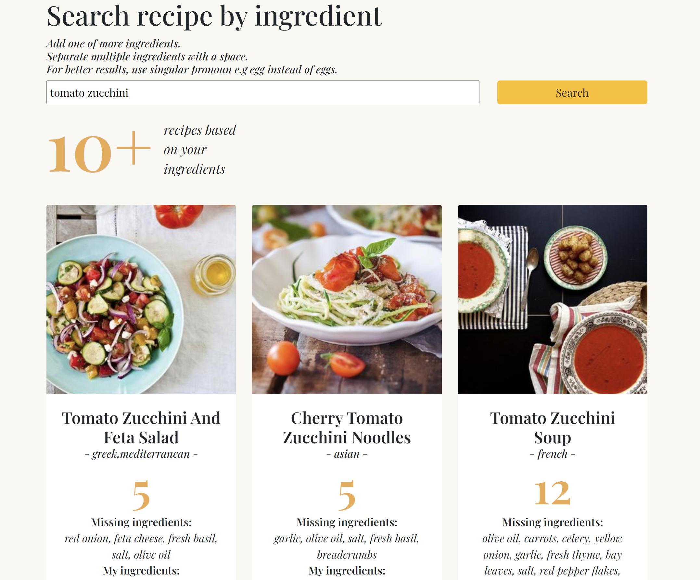

# Ingredients-To-Recipe-App

:rice: :egg: :tomato: :lemon: :eggplant:
*You have some ingredients in your fridge but don't know what to make with them?*

**IngredientsToRecipe** is a recipe search engine that allows users to search for recipes by inputting one or multiple ingredients. I used the Edamam Recipe Api https://www.edamam.com/

:rocket: The App is deployed on:
https://luminous-chaja-0c1a16.netlify.app

 **Upcomming Features:** 
- Filtering results by  **Health Label** : *Vegan, Vegetarian, Dairy-free, Gluten-free..*
